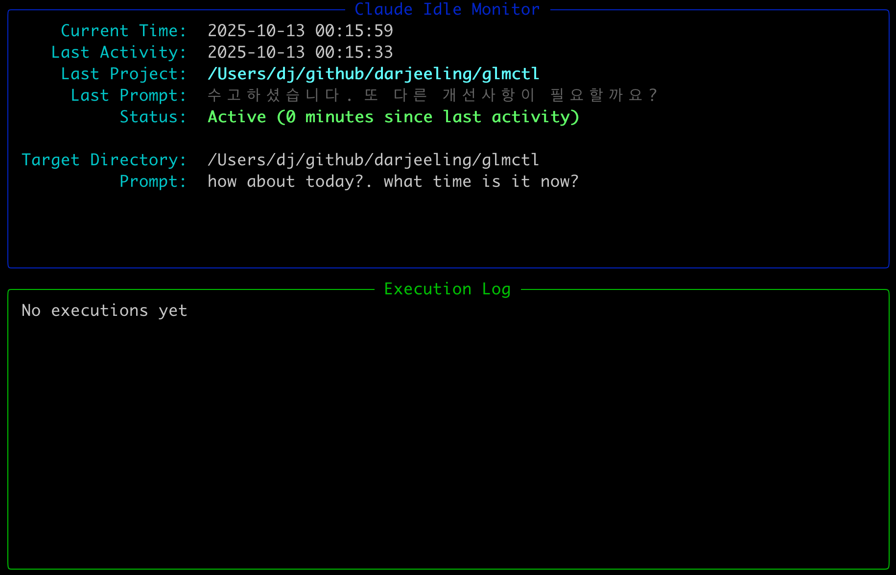

# Utils

Claude Code 관련 유틸리티 스크립트 모음

## 스크립트 목록

### 1. claude_auto_retry.sh

Claude Code를 실행하고, 실패 시 자동으로 재시도하는 Bash 스크립트입니다.

#### 기능
- Claude Code 프로세스 실행 및 모니터링
- 실패 시 (exit code ≠ 0) 자동 재시도 (기본 1.5시간 대기)
- 성공 시 (exit code = 0) 종료
- 모델 선택 지원 (opus, sonnet, haiku)
- Continue 모드 지원

#### 사용법

```bash
# 기본 사용
./claude_auto_retry.sh -q "please continue"

# 파일에서 프롬프트 읽기
./claude_auto_retry.sh -f prompt.txt -m opus

# Continue 모드로 실행
./claude_auto_retry.sh -q "build project" -c

# 추가 인자 전달
./claude_auto_retry.sh -q "run tests" -- --dangerously-skip-permissions
```

#### 옵션
- `-q "QUERY"`: 프롬프트 문자열
- `-f FILE`: 프롬프트 파일 경로
- `-m MODEL`: 모델 선택 (opus/sonnet/haiku, 기본: sonnet)
- `-c`: Continue 플래그 추가
- `--`: 이후 인자는 Claude Code에 직접 전달

#### 환경 변수
- `SLEEP_SECS`: 재시도 대기 시간 (초, 기본: 5400 = 1.5시간)
- `CLAUDE_CMD`: Claude 실행 명령어 (기본: auto-detect)

---

### 2. claude_idle_monitor.py

Claude 활동을 모니터링하고, idle 상태일 때 매시 정각마다 자동으로 Claude를 실행하는 Python 스크립트입니다.

**사용 목적**: Claude Code Plan은 5시간의 대화 제한이 있습니다. 이 스크립트는 1시간마다 자동으로 Claude를 실행하여 대화를 유지하고, 5시간 제한에 도달하지 않도록 합니다.

#### 기능
- `~/.claude/history.jsonl` 및 `~/.claude/projects/**/*.jsonl` 파일 모니터링
- 30초마다 파일 변경 시간 체크
- 10분 이상 idle 감지 시 매시 정각 (00:00, 01:00, ..., 23:00)에 자동 실행
- 실시간 TUI 대시보드 (Rich 라이브러리)
- 실행 후에도 계속 모니터링 유지

#### TUI 화면 표시
- 현재 시간
- 마지막 활동 시간
- **Last Project**: 작업 중인 프로젝트의 실제 디렉토리 경로
- **Last Prompt**: 마지막으로 실행한 프롬프트 (최대 100자)
- Idle 상태 및 경과 시간
  - Active (녹색): 활동 중
  - IDLE (빨간색): idle 상태 (10분 이상)
- 다음 실행 예정 시간 (idle일 때만)
- 설정 정보 (디렉토리, 프롬프트)
- 최근 실행 로그 (최근 5개)



#### 사용법

```bash
# 기본 사용 (현재 디렉토리, 기본 프롬프트)
uv run utils/claude_idle_monitor.py

# 디렉토리 지정
uv run utils/claude_idle_monitor.py -d /path/to/project

# 프롬프트 커스터마이징
uv run utils/claude_idle_monitor.py -p "continue all previous works"

# 디렉토리와 프롬프트 모두 지정
uv run utils/claude_idle_monitor.py \
  -d ~/projects/myapp \
  -p "check for errors and fix them"
```

#### 옵션 인자
- `-d, --directory`: Claude를 실행할 작업 디렉토리 (기본: 현재 디렉토리)
- `-p, --prompt`: Claude에 전달할 프롬프트 (기본: "how about today?. what time is it now?")

#### 고정 설정
- 체크 간격: 30초마다 파일 변경 확인
- Idle 임계값: 10분 이상 활동 없을 때 idle 상태로 판단

#### 종료
- `Ctrl+C` 또는 `SIGTERM`으로 graceful shutdown

#### 의존성
- Python 3.10+
- rich >= 13.0.0
- schedule >= 1.2.0

uv script 방식을 사용하므로 `uv run` 실행 시 자동으로 의존성이 설치됩니다.

#### 백그라운드 실행 (macOS launchd 예시)

나중에 서비스로 등록하려면:

```xml
<!-- ~/Library/LaunchAgents/com.user.claude-idle-monitor.plist -->
<?xml version="1.0" encoding="UTF-8"?>
<!DOCTYPE plist PUBLIC "-//Apple//DTD PLIST 1.0//EN" "http://www.apple.com/DTDs/PropertyList-1.0.dtd">
<plist version="1.0">
<dict>
    <key>Label</key>
    <string>com.user.claude-idle-monitor</string>
    <key>ProgramArguments</key>
    <array>
        <string>/path/to/uv</string>
        <string>run</string>
        <string>/path/to/utils/claude_idle_monitor.py</string>
        <string>-d</string>
        <string>/path/to/project</string>
        <string>-p</string>
        <string>continue all previous works</string>
    </array>
    <key>RunAtLoad</key>
    <true/>
    <key>KeepAlive</key>
    <true/>
</dict>
</plist>
```

---

## 일반적인 워크플로우

### 시나리오 1: 장시간 작업 자동 재시도
프로젝트에서 Claude가 반복적으로 작업을 수행해야 할 때:

```bash
cd /path/to/project
/path/to/utils/claude_auto_retry.sh -q "implement all remaining features"
```

### 시나리오 2: 백그라운드 모니터링
다른 작업을 하면서 Claude가 idle 상태일 때 자동으로 작업 계속:

```bash
# 프로젝트 디렉토리로 이동
cd /path/to/project

# 터미널 1: 일반 작업
claude -p "add feature X"

# 터미널 2: 모니터링 시작 (현재 디렉토리)
uv run utils/claude_idle_monitor.py

# 또는 커스텀 프롬프트로
uv run utils/claude_idle_monitor.py -p "continue all previous works"
```

10분 동안 활동이 없으면 매시 정각마다 자동으로 작업을 이어갑니다.

---

## 라이선스

이 프로젝트의 라이선스를 따릅니다.
